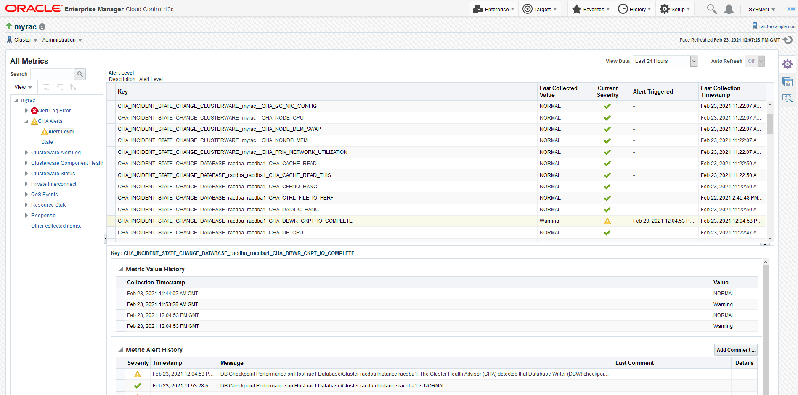

---
categories:
  - Oracle
date:
  created: 2021-02-24T01:13:00
description: >-
  Was getting CHA_DBWR_CKPT_IO_COMPLETE alerts from Oracle Enterprise Manager.
  Found that CHA checks log file switch (checkpoint incomplete) wait events.
  This post demonstrates how the root case was identified.
tags:
  - Clusterware
  - OEM
  - RAC
---

# CHA Alert CHA\_DBWR\_CKPT\_IO\_COMPLETE in OEM

A customer was getting the `CHA_DBWR_CKPT_IO_COMPLETE` alerts from Oracle Enterprise Manager (OEM).
This post investigates the root cause.

<!-- more -->

## Investigation

Sample alerts:

```
Host=rac1.example.com
Target type=Cluster
Target name=myrac
Message=DB Checkpoint Performance on Host rac1 Database/Cluster racdba Instance racdba1.
The Cluster Health Advisor (CHA) detected that Database Writer (DBW) checkpoints were slow because the database writes took longer than expected to complete.
Increase the number of DBWR processes. Add additional disks to the disk group for the database.
Relocate the database files to faster disks or to Solid State Devices.
If the storage subsystem supports a storage write back cache, check that the storage cache is functioning properly.
Severity=Warning
Event reported time=Feb 23, 2021 12:04:53 PM GMT
Operating System=Linux
Platform=x86_64
Event Type=Metric Alert
Event name=cha_alerts:cha_alert_level
Metric Group=CHA Alerts
Metric=Alert Level
Metric value=Warning
Key Value=CHA_INCIDENT_STATE_CHANGE_DATABASE_racdba_racdba1_CHA_DBWR_CKPT_IO_COMPLETE
Key Column 1=Key
Rule Name=SYSMAN Monitor Targets,rule 61
Rule Owner=SYSMAN
Update Details:
DB Checkpoint Performance on Host rac1 Database/Cluster racdba Instance racdba1.
The Cluster Health Advisor (CHA) detected that Database Writer (DBW) checkpoints were slow because the database writes took longer than expected to complete.
Increase the number of DBWR processes. Add additional disks to the disk group for the database.
Relocate the database files to faster disks or to Solid State Devices.
If the storage subsystem supports a storage write back cache, check that the storage cache is functioning properly.
```

I observed some infamous checkpoint not complete messages in the alert log, so I suspected that they might be the real cause.

Thus, I created quite small log files 20MB in size:

```sql
SQL> select group#, thread#, bytes from v$log;

    GROUP#    THREAD#      BYTES
---------- ---------- ----------
         5          1   20971520
         6          1   20971520
         7          1   20971520
         8          2   20971520
         9          2   20971520
        10          2   20971520

6 rows selected.
```

Then, I wrote a script that generates a lot of redo:

```sql
create table t
as
select o.*
  from dba_objects o,
       xmltable('1 to 50');

update t
   set object_name=object_name;
```

I ran the script and here is an excerpt from the alert log showing checkpoint not complete messages:

``` hl_lines="8 17 26 35"
2021-02-23T12:04:47.234452+00:00
Thread 1 advanced to log sequence 114 (LGWR switch),  current SCN: 7677512
  Current log# 6 seq# 114 mem# 0: +DATA/RACDBA/ONLINELOG/group_6.290.1065267481
2021-02-23T12:04:47.506174+00:00
PDB(3):Resize operation completed for file# 12, old size 645120K, new size 650240K
2021-02-23T12:04:47.848002+00:00
Thread 1 cannot allocate new log, sequence 115
Checkpoint not complete
  Current log# 6 seq# 114 mem# 0: +DATA/RACDBA/ONLINELOG/group_6.290.1065267481
2021-02-23T12:04:50.392351+00:00
Thread 1 advanced to log sequence 115 (LGWR switch),  current SCN: 7677540
  Current log# 7 seq# 115 mem# 0: +DATA/RACDBA/ONLINELOG/group_7.291.1065267483
2021-02-23T12:04:50.661220+00:00
PDB(3):Resize operation completed for file# 12, old size 650240K, new size 655360K
2021-02-23T12:04:50.993950+00:00
Thread 1 cannot allocate new log, sequence 116
Checkpoint not complete
  Current log# 7 seq# 115 mem# 0: +DATA/RACDBA/ONLINELOG/group_7.291.1065267483
2021-02-23T12:04:53.576282+00:00
Thread 1 advanced to log sequence 116 (LGWR switch),  current SCN: 7677574
  Current log# 5 seq# 116 mem# 0: +DATA/RACDBA/ONLINELOG/group_5.289.1065267477
2021-02-23T12:04:53.845381+00:00
PDB(3):Resize operation completed for file# 12, old size 655360K, new size 660480K
2021-02-23T12:04:54.183174+00:00
Thread 1 cannot allocate new log, sequence 117
Checkpoint not complete
  Current log# 5 seq# 116 mem# 0: +DATA/RACDBA/ONLINELOG/group_5.289.1065267477
2021-02-23T12:04:56.721595+00:00
Thread 1 advanced to log sequence 117 (LGWR switch),  current SCN: 7677600
  Current log# 6 seq# 117 mem# 0: +DATA/RACDBA/ONLINELOG/group_6.290.1065267481
2021-02-23T12:04:56.995439+00:00
PDB(3):Resize operation completed for file# 12, old size 660480K, new size 665600K
2021-02-23T12:04:57.332102+00:00
Thread 1 cannot allocate new log, sequence 118
Checkpoint not complete
  Current log# 6 seq# 117 mem# 0: +DATA/RACDBA/ONLINELOG/group_6.290.1065267481
```

Shortly afterwards, I got a new CHA alert in the OEM:


To understand what is happening, firstly, I started looking for some clues in the CHA log: `/u01/app/grid/crsdata/rac1/trace/chad/ochad.trc.0`, in which `/u01/app/grid` is `ORACLE_BASE` of the grid user.

```
[Thread-22] [ 2021-02-23 12:04:53.390 UTC ] [BNet.validate:422]  INFO: Tue Feb 23 12:04:50 UTC 2021 Decided CHA_DBWR_CKPT_IO_COMPLETE NORMAL (Belief= 94.900925  %) --> ABNORMAL (Belief= 81.315659  %)
[Thread-22] [ 2021-02-23 12:04:53.390 UTC ] [BNet.validate:429]  INFO: Tue Feb 23 12:04:50 UTC 2021      Children
[Thread-22] [ 2021-02-23 12:04:53.391 UTC ] [BNet.validate:446]  INFO: Tue Feb 23 12:04:50 UTC 2021           DBWR IO Completion= NORMAL
[Thread-22] [ 2021-02-23 12:04:53.391 UTC ] [BNet.validate:446]  INFO: Tue Feb 23 12:04:50 UTC 2021           log_file_switch_checkpoint_incompleteRANGE3= HIGH
[Thread-22] [ 2021-02-23 12:04:53.391 UTC ] [EventPublisher$EventRequest.dump:193]  INFO: type:DATABASE, target:racdba, host:rac1, instance:racdba1,
problem:CHA_DBWR_CKPT_IO_COMPLETE, state:ABNORMAL, time:2021-02-23 12:04:50,
evidence:[{"signal":"log_file_switch_checkpoint_incomplete", "fd":"log_file_switch_checkpoint_incompleteRANGE3", "state":"HIGH", "value":1.09745E06, "pred":null, "since":"2021-02-23 12:04:50"}]
```

Based on the evidence above, I can conclude that CHA is checking the `log file switch (checkpoint incomplete)` wait event:

```sql
SQL> select event, total_waits, total_timeouts, time_waited_micro
  2    from v$system_event
  3   where event='log file switch (checkpoint incomplete)'
  4  /

EVENT                                    TOTAL_WAITS TOTAL_TIMEOUTS TIME_WAITED_MICRO
---------------------------------------- ----------- -------------- -----------------
log file switch (checkpoint incomplete)          166              0         196362926
```

The following process accesses this file:

``` hl_lines="8"
[grid@rac1 grid]$ fuser /u01/app/grid/crsdata/rac1/trace/chad/ochad.trc.0
/u01/app/grid/crsdata/rac1/trace/chad/ochad.trc.0: 13858
[grid@rac1 grid]$ ps fww -p 13858
  PID TTY      STAT   TIME COMMAND
13858 ?        Sl     0:37 /u01/app/19.3.0/grid/jdk/bin/java -server -Xms30M -Xmx512M
-Djava.awt.headless=true -Ddisable.checkForUpdate=true -DTRACING.ENABLED=false
-XX:ParallelGCThreads=1 -cp /u01/app/19.3.0/grid/jlib/cha.jar:/u01/app/19.3.0/grid/jlib/chaconfig.jar:/u01/app/19.3.0/grid/jlib/cha-diag-msg.jar:/u01/app/19.3.0/grid/jlib/clsce.jar:/u01/app/19.3.0/grid/jlib/srvm.jar:/u01/app/19.3.0/grid/jlib/srvmhas.jar:/u01/app/19.3.0/grid/jlib/srvmasm.jar:/u01/app/19.3.0/grid/jlib/netcfg.jar:/u01/app/19.3.0/grid/jdbc/lib/ojdbc8.jar:/u01/app/19.3.0/grid/ucp/lib/ucp.jar:/u01/app/19.3.0/grid/jlib/fte.jar:/u01/app/19.3.0/grid/jlib/jai_core.jar:/u01/app/19.3.0/grid/jlib/mlibwrapper_jai.jar:/u01/app/19.3.0/grid/jlib/vecmath.jar:/u01/app/19.3.0/grid/jlib/jai_codec.jar:/u01/app/19.3.0/grid/jlib/jh.jar
oracle.cha.server.CHADDriver
```

The corresponding CRS resource is `ora.chad`:

```
[grid@rac1 trace]$ crsctl stat res ora.chad -t
--------------------------------------------------------------------------------
Name           Target  State        Server                   State details
--------------------------------------------------------------------------------
Local Resources
--------------------------------------------------------------------------------
ora.chad
               ONLINE  ONLINE       rac1                     STABLE
               ONLINE  ONLINE       rac2                     STABLE
--------------------------------------------------------------------------------
```

It can be managed by `srvctl` commands: `srvctl stop/status/start cha`.

CHA is tightly integrated with the Grid Infrastructure Management Repository (GIMR).
In fact, most `chactl` commands cannot work without it.
However, I do not use GIMR, and it appears that some CHA functionality is still available, at least part of it that can publish database related events to OEM.
It is explained in the following whitepaper: [Oracle Database 12c Rel. 2 Cluster Health Advisor - Deep Dive How it Works and How to Use It](https://www.oracle.com/technetwork/database/options/clustering/ahf/learnmore/cluster-health-advisor-3867511.pdf)

## Conclusion

I do not think that the message produced by the `CHA_DBWR_CKPT_IO_COMPLETE` alert has appropriate solutions:

> DB Checkpoint Performance on Host rac1 Database/Cluster racdba Instance racdba1.
>
> The Cluster Health Advisor (CHA) detected that Database Writer (DBW) checkpoints were slow because the database writes took longer than expected to complete.
>
> Increase the number of DBWR processes. Add additional disks to the disk group for the database.
>
> Relocate the database files to faster disks or to Solid State Devices.
>
> If the storage subsystem supports a storage write back cache, check that the storage cache is functioning properly.

It is usually much easier to increase the total redo size, either by adding additional log groups, changing the size of the existing ones, or both.
All of these actions give more chances to DBWR to catch up.

When there are CHA alerts in OEM, it makes sense to check the CHA log: `/u01/app/grid/crsdata/rac1/trace/chad/ochad.trc.0`.
It has some invaluable information that could reveal the exact cause.
