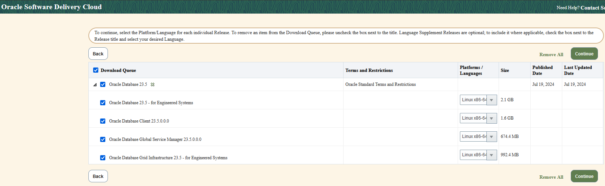

---
categories:
  - Oracle
date:
  created: 2024-09-06
description: >-
  Установка Oracle Database 23.5 for Engineered Systems на не-Exadata.
  Выявленная ошибка ORA-27350 и методы её обхода
tags:
  - 23ai
  - Code symbol
  - Exadata
  - Initialization parameter
  - OERR
---

# Установка Oracle Database 23.5 for Engineered Systems на не-Exadata

Oracle 23ai всё ещё не вышел для on-prem систем.
В то же время на eDelivery доступна версия 23.5 для инженерных систем с июля этого года.
Данная заметка посвящена установке этой версии на неинженерные системы.

<!-- more -->

## Окружение

Я использовал Oracle Linux 8 UEK6 в одном из публичных облаков.
Проведённые тесты и выводы должны быть применимы для on-prem систем, но я проверял только в облаках.

## Установка

Дистрибутив скачивается как обычно.



При установке БД проблем не обнаружено.

??? "Команды установки и их вывод"

    ```bash title="oracle"
    [oracle@myhostname swtmp]$ mkdir -p /u01/app/oracle/product/23.5.0/dbhome_1
    [oracle@myhostname swtmp]$ unzip -qd /u01/app/oracle/product/23.5.0/dbhome_1 V1043785-01.zip
    [oracle@myhostname swtmp]$ /u01/app/oracle/product/23.5.0/dbhome_1/runInstaller -silent \
    >     ORACLE_BASE=/u01/app/oracle \
    >     oracle.install.option=INSTALL_DB_SWONLY \
    >     oracle.install.db.OSBACKUPDBA_GROUP=dba \
    >     oracle.install.db.OSDBA_GROUP=dba \
    >     oracle.install.db.OSDGDBA_GROUP=dba \
    >     oracle.install.db.OSKMDBA_GROUP=dba \
    >     oracle.install.db.OSRACDBA_GROUP=dba
    Launching Oracle Database Setup Wizard...

    *********************************************
    Swap Size: This is a prerequisite condition to test whether sufficient total swap space is available on the system.
    Severity: IGNORABLE
    Overall status: VERIFICATION_FAILED
    Error message: PRVF-7573 : Sufficient swap size is not available on node "myhostname" [Required = 15.6097GB (1.6368E7KB) ; Found = 0.0 bytes]
    Cause:  The swap size found does not meet the minimum requirement.
    Action:  Increase swap size to at least meet the minimum swap space requirement.
    -----------------------------------------------
    [WARNING] [INS-13014] Target environment does not meet some optional requirements.
       CAUSE: Some of the optional prerequisites are not met. See logs for details. installActions2024-07-31_12-27-04PM.log.
       ACTION: Identify the list of failed prerequisite checks from the log: installActions2024-07-31_12-27-04PM.log. Then either from the log file or from installation manual find the appropriate configuration to meet the prerequisites and fix it manually.
    The response file for this session can be found at:
     /u01/app/oracle/product/23.5.0/dbhome_1/install/response/db_2024-07-31_12-27-04PM.rsp

    You can find the log of this install session at:
     /tmp/InstallActions2024-07-31_12-27-04PM/installActions2024-07-31_12-27-04PM.log

    As a root user, run the following script(s):
            1. /u01/app/oraInventory/orainstRoot.sh
            2. /u01/app/oracle/product/23.5.0/dbhome_1/root.sh

    Run /u01/app/oraInventory/orainstRoot.sh on the following nodes:
    [myhostname]
    Run /u01/app/oracle/product/23.5.0/dbhome_1/root.sh on the following nodes:
    [myhostname]


    Successfully Setup Software with warning(s).
    Moved the install session logs to:
     /u01/app/oraInventory/logs/InstallActions2024-07-31_12-27-04PM
    ```

    ```bash title="root"
    [root@myhostname ~]# /u01/app/oraInventory/orainstRoot.sh
    Changing permissions of /u01/app/oraInventory.
    Adding read,write permissions for group.
    Removing read,write,execute permissions for world.

    Changing groupname of /u01/app/oraInventory to oinstall.
    The execution of the script is complete.
    [root@myhostname ~]# /u01/app/oracle/product/23.5.0/dbhome_1/root.sh
    Check /u01/app/oracle/product/23.5.0/dbhome_1/install/root_myhostname.mycompany.mydomain_2024-07-31_12-29-10-585011304.log for the output of root script
    ```

## Создание БД

Первые проблемы возникают при создании БД через `DBCA`:

```bash hl_lines="25 27"
[oracle@myhostname ~]$ dbca -silent -createDatabase \
>   -responseFile NO_VALUE \
>   -templateName New_Database.dbt \
>   -gdbname orcl \
>   -characterSet AL32UTF8 \
>   -sysPassword Oracle123 \
>   -systemPassword Oracle123 \
>   -createAsContainerDatabase true \
>   -numberOfPDBs 1 \
>   -pdbName PDB \
>   -pdbAdminPassword Oracle123 \
>   -databaseType MULTIPURPOSE \
>   -automaticMemoryManagement false \
>   -totalMemory 4096 \
>   -redoLogFileSize 512 \
>   -emConfiguration NONE \
>   -ignorePreReqs \
>   -storageType FS \
>   -datafileDestination /u01/app/oracle/oradata
Prepare for db operation
4% complete
Creating and starting Oracle instance
5% complete
6% complete
[WARNING] ORA-27350: This version of the Oracle Database software cannot be run on this platform

[FATAL] ORA-01034: The Oracle instance is not available for use. Start the instance.

8% complete
100% complete
[FATAL] ORA-01034: The Oracle instance is not available for use. Start the instance.

4% complete
0% complete
Look at the log file "/u01/app/oracle/cfgtoollogs/dbca/orcl/orcl.log" for further details.
```

Как видно, в выводе присутствует предупреждение `ORA-27350: This version of the Oracle Database software cannot be run on this platform` с последующим фатальным `ORA-01034`.
Ошибки возникают при старте экземпляра.
На данный момент уже есть документ об этой ошибке без указания обходных решений: [ORA-27350 Installing Oracle 23ai (Doc ID 3039943.1)](https://support.oracle.com/rs?type=doc&id=3039943.1).

Ниже указано несколько вариантов обхода данной ошибки.

## Обход `ORA-27350`

### Параметр `_exadata_feature_on`

Простейший вариант обхода через установку `_exadata_feature_on=true`:

```bash title="Вывод DBCA с _exadata_feature_on=true"
[oracle@myhostname ~]$ dbca -silent -createDatabase \
>   -responseFile NO_VALUE \
>   -templateName New_Database.dbt \
>   -gdbname orcl \
>   -characterSet AL32UTF8 \
>   -sysPassword Oracle123 \
>   -systemPassword Oracle123 \
>   -createAsContainerDatabase true \
>   -numberOfPDBs 1 \
>   -pdbName PDB \
>   -pdbAdminPassword Oracle123 \
>   -databaseType MULTIPURPOSE \
>   -automaticMemoryManagement false \
>   -totalMemory 4096 \
>   -redoLogFileSize 512 \
>   -emConfiguration NONE \
>   -ignorePreReqs \
>   -storageType FS \
>   -datafileDestination /u01/app/oracle/oradata \
>   -initParams "_exadata_feature_on=true"
Prepare for db operation
4% complete
Creating and starting Oracle instance
5% complete
6% complete
8% complete
Creating database files
9% complete
13% complete
Creating data dictionary views
14% complete
16% complete
18% complete
19% complete
25% complete
Oracle JVM
31% complete
38% complete
44% complete
46% complete
Oracle Text
48% complete
50% complete
Oracle OLAP
54% complete
Oracle Spatial
55% complete
63% complete
Creating cluster database views
71% complete
Completing Database Creation
73% complete
75% complete
Creating Pluggable Databases
78% complete
88% complete
Executing Post Configuration Actions
100% complete
Database creation complete. For details check the logfiles at:
 /u01/app/oracle/cfgtoollogs/dbca/orcl.
Database Information:
Global Database Name:orcl
System Identifier(SID):orcl
Look at the log file "/u01/app/oracle/cfgtoollogs/dbca/orcl/orcl.log" for further details.
```

### Смена домена

Пока я изучал функции, приводящие к `ORA-27350`, в отладчике, я обратил внимание, что одна из функций выполняет проверку поддомена.
Конкретно, `kscs_check_is_oracle_domain` проверяет, находится ли имя хоста в одном из поддоменов `oracle.com` (а также ещё одного Oracle поддомена).
Функция выбрана не случайно, т.к. она учавствует в цепочке проверок, приводящих к ошибке.
После установки нового имени хоста:

```bash
[root@myhostname ~]# hostnamectl set-hostname myhostname.abc.oracle.com
[root@myhostname ~]# hostname
myhostname.abc.oracle.com
```

Запуск `DBCA` завершается успешно без `_exadata_feature_on=true`:

```bash title="Вывод DBCA после смены домена"
[oracle@myhostname ~]$ dbca -silent -createDatabase \
>   -responseFile NO_VALUE \
>   -templateName New_Database.dbt \
>   -gdbname orcl \
>   -characterSet AL32UTF8 \
>   -sysPassword Oracle123 \
>   -systemPassword Oracle123 \
>   -createAsContainerDatabase true \
>   -numberOfPDBs 1 \
>   -pdbName PDB \
>   -pdbAdminPassword Oracle123 \
>   -databaseType MULTIPURPOSE \
>   -automaticMemoryManagement false \
>   -totalMemory 4096 \
>   -redoLogFileSize 512 \
>   -emConfiguration NONE \
>   -ignorePreReqs \
>   -storageType FS \
>   -datafileDestination /u01/app/oracle/oradata
Prepare for db operation
4% complete
Creating and starting Oracle instance
5% complete
6% complete
8% complete
Creating database files
9% complete
13% complete
Creating data dictionary views
14% complete
16% complete
18% complete
19% complete
25% complete
Oracle JVM
31% complete
38% complete
44% complete
46% complete
Oracle Text
48% complete
50% complete
Oracle OLAP
54% complete
Oracle Spatial
55% complete
63% complete
Creating cluster database views
71% complete
Completing Database Creation
73% complete
75% complete
Creating Pluggable Databases
78% complete
88% complete
Executing Post Configuration Actions
100% complete
Database creation complete. For details check the logfiles at:
 /u01/app/oracle/cfgtoollogs/dbca/orcl.
Database Information:
Global Database Name:orcl
System Identifier(SID):orcl
Look at the log file "/u01/app/oracle/cfgtoollogs/dbca/orcl/orcl.log" for further details.
```

### Обход проверки домена через `LD_PRELOAD`

Обойти проверку домена без его смены можно также через `LD_PRELOAD`:

```c title="strstr.c"
#define _GNU_SOURCE
#include <dlfcn.h>
#include <string.h>

static char* (*orig_strstr)(const char *haystack, const char *needle) = NULL;

char *strstr(const char *haystack, const char *needle)
{
        if (strcmp(needle, ".oracle.com") == 0)
        {
                return needle;
        }
        if (orig_strstr == NULL)
        {
                orig_strstr = dlsym(RTLD_NEXT, "strstr");
        }
        return orig_strstr(haystack, needle);
}
```

```bash title="Создание разделяемой библиотеки"
gcc -Wall -fPIC -shared strstr.c -o strstr.o -ldl
```

!!! note "Примечание"

    Замена `strstr` достаточна для старта экземпляра и `DBCA`.
    Более правильная реализация подмена имени хоста через `gethostname`, `gethostbyname` достаточна для старта экземпляра, но не для создания БД через `DBCA`.
    Поэтому проще и безопаснее использовать `strstr` для демонстрации.

```bash title="Создание БД с LD_PRELOAD"
[oracle@myhostname ~]$ LD_PRELOAD=/home/oracle/strstr.o dbca -silent -createDatabase \
>   -responseFile NO_VALUE \
>   -templateName New_Database.dbt \
>   -gdbname orcl \
>   -characterSet AL32UTF8 \
>   -sysPassword Oracle123 \
>   -systemPassword Oracle123 \
>   -createAsContainerDatabase true \
>   -numberOfPDBs 1 \
>   -pdbName PDB \
>   -pdbAdminPassword Oracle123 \
>   -databaseType MULTIPURPOSE \
>   -automaticMemoryManagement false \
>   -totalMemory 4096 \
>   -redoLogFileSize 512 \
>   -emConfiguration NONE \
>   -ignorePreReqs \
>   -storageType FS \
>   -datafileDestination /u01/app/oracle/oradata
Prepare for db operation
4% complete
Creating and starting Oracle instance
5% complete
6% complete
8% complete
Creating database files
9% complete
13% complete
Creating data dictionary views
14% complete
16% complete
18% complete
19% complete
25% complete
Oracle JVM
31% complete
38% complete
44% complete
46% complete
Oracle Text
48% complete
50% complete
Oracle OLAP
54% complete
Oracle Spatial
55% complete
63% complete
Creating cluster database views
71% complete
Completing Database Creation
73% complete
75% complete
Creating Pluggable Databases
78% complete
88% complete
Executing Post Configuration Actions
100% complete
Database creation complete. For details check the logfiles at:
 /u01/app/oracle/cfgtoollogs/dbca/orcl.
Database Information:
Global Database Name:orcl
System Identifier(SID):orcl
Look at the log file "/u01/app/oracle/cfgtoollogs/dbca/orcl/orcl.log" for further details.
```

## Замечания

### Старт БД

`ORA-27350` возникает при старте БД.
Это удобно использовать для тестирования различных вариантов обхода ошибки.
Например, вывод ниже демонстрирует старты БД с разными именами хоста:

``` title="Старты БД с разными именами хоста"
SQL> startup
ORA-27350: This version of the Oracle Database software cannot be run on this platform
SQL> !hostname
myhostname.abc.oracle.com.mycompany.mydomain

SQL> startup
ORA-27350: This version of the Oracle Database software cannot be run on this platform
SQL> !hostname
myhostname.abc.oracle.com.mycompany

SQL> startup
ORA-27350: This version of the Oracle Database software cannot be run on this platform
SQL> !hostname
myhostname.abc.oracle.com

SQL> startup
ORACLE instance started.

Total System Global Area 3218669368 bytes
Fixed Size                  5365560 bytes
Variable Size             654311424 bytes
Database Buffers         2550136832 bytes
Redo Buffers                8855552 bytes
Database mounted.
Database opened.
```

### Grid Infrastructure

С GI возникает та же ошибка `ORA-27350`, но на более раннем этапе, когда GI запускает ASM экземпляр.
Обходится теми же способами указанными выше со своей спецификой.
Конкретно я изменял имя хоста через `hostnamectl`.
