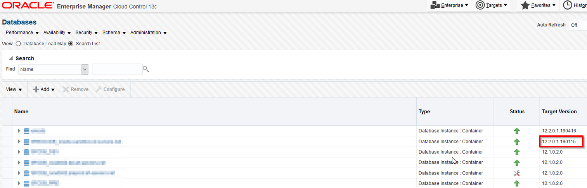
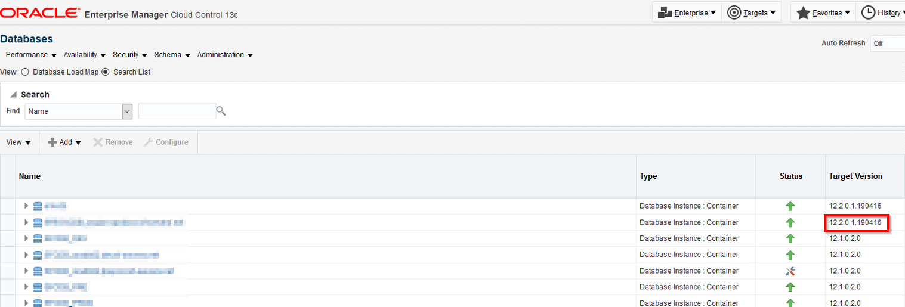

---
categories:
  - Oracle
date:
  created: 2019-06-01T22:32:00
description: >-
  The database version in Oracle Enterprise Manager was not updated after patching.
  I had to run the emctl reload agent dynamicproperties command to have the version updated.
tags:
  - OEM
---

# OEM Target Version not updated after applying RU patch

After applying the 12.2.0.1.190416 Release Update (RU) patch, I noticed that the target version had not been updated.

<!-- more -->



I searched through My Oracle Support (MOS) and found a few similar issues where it was recommended to refresh the configuration of the host in question.
Thus, I performed the refresh operation for both the host configuration and the database configuration, yet the version was still the old one.

Here are the targets that are registered on the problem host:

``` hl_lines="12"
[oraagent@oracle-sandbox bin]$ ./emctl config agent listtargets
Oracle Enterprise Manager Cloud Control 13c Release 3
Copyright (c) 1996, 2018 Oracle Corporation.  All rights reserved.
[oracle-sandbox.domain, host]
[oracle-sandbox.domain:3872, oracle_emd]
[+ASM_oracle-sandbox.domain, osm_instance]
[OraDB12Home1_2_oracle-sandbox.domain_3696, oracle_home]
[OraHome1Grid_1_oracle-sandbox.domain_6710, oracle_home]
[agent13c1_3_oracle-sandbox.domain_5948, oracle_home]
[has_oracle-sandbox.domain, has]
[OraGI12Home1_4_oracle-sandbox.domain_67, oracle_home]
[BOXCDB_oracle-sandbox.domain, oracle_database]
[BOXCDB_oracle-sandbox.domain_CDB$ROOT, oracle_pdb]
[BOXCDB_oracle-sandbox.domain_BOXPDB, oracle_pdb]
```

I ran the following command after which the issue was resolved:

```
[oraagent@oracle-sandbox bin]$ ./emctl reload agent dynamicproperties BOXCDB_oracle-sandbox.domain:oracle_database
Oracle Enterprise Manager Cloud Control 13c Release 3
Copyright (c) 1996, 2018 Oracle Corporation.  All rights reserved.
---------------------------------------------------------------
EMD recompute dynprops completed successfully
```

The correct version finally appeared on the database page:


