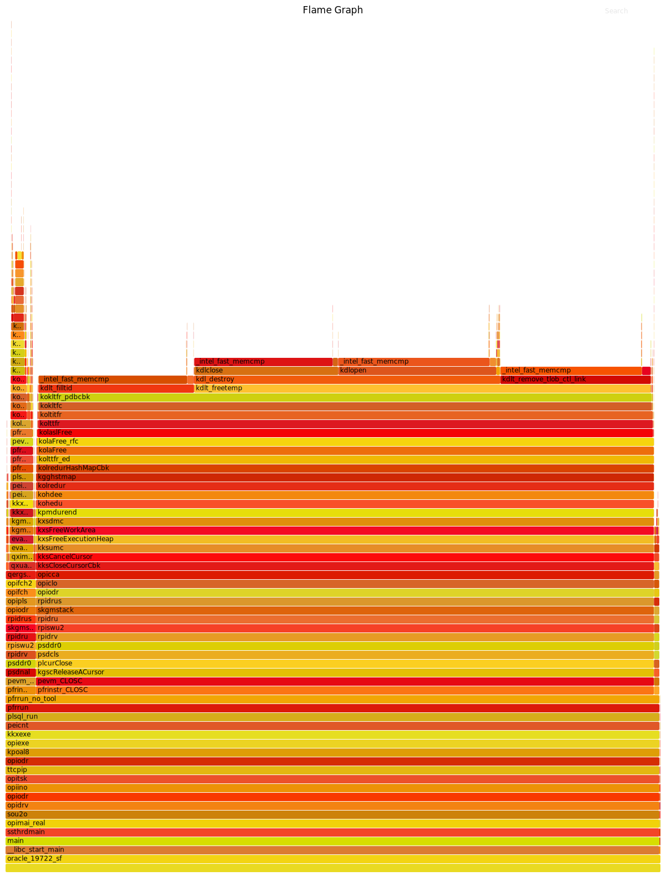

---
categories:
  - Oracle
date:
  created: 2019-07-31T03:24:00
  updated: 2020-04-15T16:22:03
description: >-
  Queries creating many abstract LOBs may spend its time in the IN_CURSOR_CLOSE state and consume lots of PGA memory.
  A new bug is opened with Oracle Support for that: Bug 30213404 : CLOSE OF CURSORS IS VERY SLOW WITH LARGE PGA ALLOCATIONS.
  It is also found that 19c allocates PGA memory in larger chunks.
tags:
  - 12c
  - 19c
  - Bug
  - Code symbol
  - Diagnostic event
  - Initialization parameter
  - LOB
  - Performance
---

# Session spending its time IN\_CURSOR\_CLOSE

I encountered that issue originally when I migrated one of my databases to 12.2.0.1.190416.

<!-- more -->

## Investigation

I started my investigation when observed the following rows in `V$ACTIVE_SESSION_HISTORY` for one execution:

```sql
SQL> select to_char(sample_time, 'hh24:mi:ss') sample_time, sql_id, sql_opname, top_level_sql_id, session_state, event,
  2         trim(case when IN_CONNECTION_MGMT='Y' then ' IN_CONNECTION_MGMT' end||
  3              case when IN_PARSE='Y' then ' IN_PARSE' end||
  4              case when IN_HARD_PARSE='Y' then ' IN_HARD_PARSE' end||
  5              case when IN_SQL_EXECUTION='Y' then ' IN_SQL_EXECUTION' end||
  6              case when IN_PLSQL_EXECUTION='Y' then ' IN_PLSQL_EXECUTION' end||
  7              case when IN_PLSQL_RPC='Y' then ' IN_PLSQL_RPC' end||
  8              case when IN_PLSQL_COMPILATION='Y' then ' IN_PLSQL_COMPILATION' end||
  9              case when IN_JAVA_EXECUTION='Y' then ' IN_JAVA_EXECUTION' end||
 10              case when IN_BIND='Y' then ' IN_BIND' end||
 11              case when IN_CURSOR_CLOSE='Y' then ' IN_CURSOR_CLOSE' end||
 12              case when IN_SEQUENCE_LOAD='Y' then ' IN_SEQUENCE_LOAD' end||
 13              case when IN_INMEMORY_QUERY='Y' then ' IN_INMEMORY_QUERY' end||
 14              case when IN_INMEMORY_POPULATE='Y' then ' IN_INMEMORY_POPULATE' end||
 15              case when IN_INMEMORY_PREPOPULATE='Y' then ' IN_INMEMORY_PREPOPULATE' end||
 16              case when IN_INMEMORY_REPOPULATE='Y' then ' IN_INMEMORY_REPOPULATE' end||
 17              case when IN_INMEMORY_TREPOPULATE='Y' then ' IN_INMEMORY_TREPOPULATE' end||
 18              case when IN_TABLESPACE_ENCRYPTION='Y' then ' IN_TABLESPACE_ENCRYPTION' end) activity
 19    from v$active_session_history
 20   where session_id = 58
 21     and sample_time between timestamp'2019-07-30 20:47:41' and timestamp'2019-07-30 20:48:30'
 22   order by sample_time;

SAMPLE_T SQL_ID        SQL_OPNAME TOP_LEVEL_SQL SESSION EVENT      ACTIVITY
-------- ------------- ---------- ------------- ------- ---------- ---------------------------------------------------
20:47:42 a6n6qc8g855q6 SELECT     2puw0smn3qw99 ON CPU             IN_SQL_EXECUTION IN_PLSQL_EXECUTION
20:47:43 a6n6qc8g855q6 SELECT     2puw0smn3qw99 ON CPU             IN_SQL_EXECUTION IN_PLSQL_EXECUTION
20:47:44                          2puw0smn3qw99 ON CPU             IN_SQL_EXECUTION IN_PLSQL_EXECUTION IN_CURSOR_CLOSE
20:47:45                          2puw0smn3qw99 ON CPU             IN_SQL_EXECUTION IN_PLSQL_EXECUTION IN_CURSOR_CLOSE
20:47:46                          2puw0smn3qw99 ON CPU             IN_SQL_EXECUTION IN_PLSQL_EXECUTION IN_CURSOR_CLOSE
20:47:47                          2puw0smn3qw99 ON CPU             IN_SQL_EXECUTION IN_PLSQL_EXECUTION IN_CURSOR_CLOSE
20:47:48                          2puw0smn3qw99 ON CPU             IN_SQL_EXECUTION IN_PLSQL_EXECUTION IN_CURSOR_CLOSE
20:47:49                          2puw0smn3qw99 ON CPU             IN_SQL_EXECUTION IN_PLSQL_EXECUTION IN_CURSOR_CLOSE
20:47:50                          2puw0smn3qw99 ON CPU             IN_SQL_EXECUTION IN_PLSQL_EXECUTION IN_CURSOR_CLOSE
20:47:51                          2puw0smn3qw99 ON CPU             IN_SQL_EXECUTION IN_PLSQL_EXECUTION IN_CURSOR_CLOSE
20:47:52                          2puw0smn3qw99 ON CPU             IN_SQL_EXECUTION IN_PLSQL_EXECUTION IN_CURSOR_CLOSE
20:47:53                          2puw0smn3qw99 ON CPU             IN_SQL_EXECUTION IN_PLSQL_EXECUTION IN_CURSOR_CLOSE
20:47:54                          2puw0smn3qw99 ON CPU             IN_SQL_EXECUTION IN_PLSQL_EXECUTION IN_CURSOR_CLOSE
20:47:55                          2puw0smn3qw99 ON CPU             IN_SQL_EXECUTION IN_PLSQL_EXECUTION IN_CURSOR_CLOSE
20:47:56                          2puw0smn3qw99 ON CPU             IN_SQL_EXECUTION IN_PLSQL_EXECUTION IN_CURSOR_CLOSE
20:47:57                          2puw0smn3qw99 ON CPU             IN_SQL_EXECUTION IN_PLSQL_EXECUTION IN_CURSOR_CLOSE
20:47:58                          2puw0smn3qw99 ON CPU             IN_SQL_EXECUTION IN_PLSQL_EXECUTION IN_CURSOR_CLOSE
20:47:59                          2puw0smn3qw99 ON CPU             IN_SQL_EXECUTION IN_PLSQL_EXECUTION IN_CURSOR_CLOSE
20:48:00                          2puw0smn3qw99 ON CPU             IN_SQL_EXECUTION IN_PLSQL_EXECUTION IN_CURSOR_CLOSE
20:48:01                          2puw0smn3qw99 ON CPU             IN_SQL_EXECUTION IN_PLSQL_EXECUTION IN_CURSOR_CLOSE
20:48:02                          2puw0smn3qw99 ON CPU             IN_SQL_EXECUTION IN_PLSQL_EXECUTION IN_CURSOR_CLOSE
20:48:03                          2puw0smn3qw99 ON CPU             IN_SQL_EXECUTION IN_PLSQL_EXECUTION IN_CURSOR_CLOSE
20:48:04                          2puw0smn3qw99 ON CPU             IN_SQL_EXECUTION IN_PLSQL_EXECUTION IN_CURSOR_CLOSE
20:48:05                          2puw0smn3qw99 ON CPU             IN_SQL_EXECUTION IN_PLSQL_EXECUTION IN_CURSOR_CLOSE
20:48:06                          2puw0smn3qw99 ON CPU             IN_SQL_EXECUTION IN_PLSQL_EXECUTION IN_CURSOR_CLOSE
20:48:07                          2puw0smn3qw99 ON CPU             IN_SQL_EXECUTION IN_PLSQL_EXECUTION IN_CURSOR_CLOSE
20:48:08                          2puw0smn3qw99 ON CPU             IN_SQL_EXECUTION IN_PLSQL_EXECUTION IN_CURSOR_CLOSE
20:48:09                          2puw0smn3qw99 ON CPU             IN_SQL_EXECUTION IN_PLSQL_EXECUTION IN_CURSOR_CLOSE
20:48:10                          2puw0smn3qw99 ON CPU             IN_SQL_EXECUTION IN_PLSQL_EXECUTION IN_CURSOR_CLOSE
20:48:11                          2puw0smn3qw99 ON CPU             IN_SQL_EXECUTION IN_PLSQL_EXECUTION IN_CURSOR_CLOSE
20:48:12                          2puw0smn3qw99 ON CPU             IN_SQL_EXECUTION IN_PLSQL_EXECUTION IN_CURSOR_CLOSE
20:48:13                          2puw0smn3qw99 ON CPU             IN_SQL_EXECUTION IN_PLSQL_EXECUTION IN_CURSOR_CLOSE
20:48:14                          2puw0smn3qw99 ON CPU             IN_SQL_EXECUTION IN_PLSQL_EXECUTION IN_CURSOR_CLOSE
20:48:15                          2puw0smn3qw99 ON CPU             IN_SQL_EXECUTION IN_PLSQL_EXECUTION IN_CURSOR_CLOSE
20:48:16                          2puw0smn3qw99 ON CPU             IN_SQL_EXECUTION IN_PLSQL_EXECUTION IN_CURSOR_CLOSE
20:48:17                          2puw0smn3qw99 ON CPU             IN_SQL_EXECUTION IN_PLSQL_EXECUTION IN_CURSOR_CLOSE
20:48:18                          2puw0smn3qw99 ON CPU             IN_SQL_EXECUTION IN_PLSQL_EXECUTION IN_CURSOR_CLOSE
20:48:19                          2puw0smn3qw99 ON CPU             IN_SQL_EXECUTION IN_PLSQL_EXECUTION IN_CURSOR_CLOSE
20:48:20                          2puw0smn3qw99 ON CPU             IN_SQL_EXECUTION IN_PLSQL_EXECUTION IN_CURSOR_CLOSE
20:48:21                          2puw0smn3qw99 ON CPU             IN_SQL_EXECUTION IN_PLSQL_EXECUTION IN_CURSOR_CLOSE
20:48:22                          2puw0smn3qw99 ON CPU             IN_SQL_EXECUTION IN_PLSQL_EXECUTION IN_CURSOR_CLOSE
20:48:23                          2puw0smn3qw99 ON CPU             IN_SQL_EXECUTION IN_PLSQL_EXECUTION IN_CURSOR_CLOSE
20:48:24                          2puw0smn3qw99 ON CPU             IN_SQL_EXECUTION IN_PLSQL_EXECUTION IN_CURSOR_CLOSE
20:48:25                          2puw0smn3qw99 ON CPU             IN_SQL_EXECUTION IN_PLSQL_EXECUTION IN_CURSOR_CLOSE
20:48:26                          2puw0smn3qw99 ON CPU             IN_SQL_EXECUTION IN_PLSQL_EXECUTION IN_CURSOR_CLOSE
20:48:27                          2puw0smn3qw99 ON CPU             IN_SQL_EXECUTION IN_PLSQL_EXECUTION IN_CURSOR_CLOSE
20:48:28                          2puw0smn3qw99 ON CPU             IN_SQL_EXECUTION IN_PLSQL_EXECUTION IN_CURSOR_CLOSE
20:48:29                          2puw0smn3qw99 ON CPU             IN_SQL_EXECUTION IN_PLSQL_EXECUTION IN_CURSOR_CLOSE
```

That was quite unusual as there was no `SQL_ID` and `IN_CURSOR_CLOSE` was set to `Y`.

Here is an over-simplified version of what the session was doing:

```sql hl_lines="32 33"
SQL> declare
  2    cursor test_csr is
  3      select t1.*, user_agg_function(to_char(l)) c1
  4        from (select level l from dual connect by level<=30001) t1
  5       group by t1.l;
  6    type test_tbl_type is table of test_csr%rowtype;
  7    v_test_tbl test_tbl_type;
  8  begin
  9    open test_csr;
 10
 11    dbms_output.put_line(systimestamp||' After open');
 12
 13    for i in 1..6
 14    loop
 15      fetch test_csr bulk collect into v_test_tbl limit 5000;
 16      dbms_output.put_line(systimestamp||' After fetch');
 17    end loop;
 18
 19    dbms_output.put_line(systimestamp||' After all fetches');
 20
 21    close test_csr;
 22    dbms_output.put_line(systimestamp||' After close');
 23  end;
 24  /
30-JUL-19 08.47.41.576257000 PM +01:00 After open
30-JUL-19 08.47.41.866173000 PM +01:00 After fetch
30-JUL-19 08.47.42.153764000 PM +01:00 After fetch
30-JUL-19 08.47.42.455019000 PM +01:00 After fetch
30-JUL-19 08.47.42.775041000 PM +01:00 After fetch
30-JUL-19 08.47.43.137562000 PM +01:00 After fetch
30-JUL-19 08.47.43.688608000 PM +01:00 After fetch
30-JUL-19 08.47.43.688630000 PM +01:00 After all fetches
30-JUL-19 08.48.30.799487000 PM +01:00 After close

PL/SQL procedure successfully completed.

Elapsed: 00:00:49.80
```

So it performed 6 fetches in 2 seconds and then spent the remaining 47 seconds while closing the cursor, huh?
[Flamegraphs](https://github.com/brendangregg/FlameGraph) are quite useful in diagnosing such issues:



All of those `kksumc`, `kxsFreeExecutionHeap`, `kxsFreeWorkArea`, `kxsdmc`, and others are memory free/releasing cursor routines.
As you might guess, the nature of this issue is related to that user-defined type from the query.
Here is the code that I used for that demo:

```sql hl_lines="45 46"
CREATE OR REPLACE TYPE user_agg_t as object(
  v_clob       clob,

  static function ODCIAggregateInitialize(sctx IN OUT NOCOPY user_agg_t)
    return number,

  member function ODCIAggregateIterate(self IN OUT NOCOPY user_agg_t,
                                       value IN varchar2)
    return number,

  member function ODCIAggregateTerminate(self IN OUT NOCOPY user_agg_t,
                                         returnValue OUT NOCOPY clob,
                                         flags IN number)
    return number,

  member function ODCIAggregateMerge(self IN OUT NOCOPY user_agg_t,
                                     ctx2 IN OUT NOCOPY user_agg_t)
    return number
);
/

CREATE OR REPLACE TYPE BODY user_agg_t
is

  static function ODCIAggregateInitialize(sctx IN OUT NOCOPY user_agg_t)
    return number is
  begin
    sctx := user_agg_t(null);
    return ODCIConst.Success;
  end;

  member function ODCIAggregateIterate(self   IN OUT NOCOPY user_agg_t,
                                       value  IN varchar2)
    return number
  is
  begin
    return ODCIConst.Success;
  end;

  member function ODCIAggregateTerminate(self IN OUT NOCOPY user_agg_t,
                                         returnValue OUT NOCOPY clob,
                                         flags IN number)
    return number is
  begin
    self.v_clob := 'finished';
    returnValue := self.v_clob;
    return ODCIConst.Success;
  end;

  member function ODCIAggregateMerge(self IN OUT NOCOPY user_agg_t,
                                     ctx2 IN OUT NOCOPY user_agg_t)
    return number is
  begin
    return ODCIConst.Success;
  end;
end;
/

CREATE OR REPLACE FUNCTION user_agg_function (input varchar2) RETURN clob PARALLEL_ENABLE AGGREGATE USING user_agg_t;
/
```

There is an abstract LOB created in the highlighted lines.
While the anonymous block is running, it creates a lot of those abstract LOBs, upto 30,000 which is the number of rows that I fetch from that cursor (I am checking it through `V$TEMPORARY_LOBS`).
When I call the close cursor line, the server process decides that it is time to free up all of those resources back, and that is what is taking so much time; here is the relevant output:

```sql
SQL> select to_char(sysdate, 'hh24:mi:ss') current_time, l.* from v$temporary_lobs l;

-- The session is executing
CURRENT_        SID CACHE_LOBS NOCACHE_LOBS ABSTRACT_LOBS     CON_ID
-------- ---------- ---------- ------------ ------------- ----------
21:32:23         47          0            0             0          3
21:32:23         58      23921            0         23922          3

SQL> /

-- It created upto 30K abstract LOBs
CURRENT_        SID CACHE_LOBS NOCACHE_LOBS ABSTRACT_LOBS     CON_ID
-------- ---------- ---------- ------------ ------------- ----------
21:32:24         47          0            0             0          3
21:32:24         58      29737            0         29738          3

SQL> /

-- Now it is steadily deallocating them
CURRENT_        SID CACHE_LOBS NOCACHE_LOBS ABSTRACT_LOBS     CON_ID
-------- ---------- ---------- ------------ ------------- ----------
21:32:25         47          0            0             0          3
21:32:25         58      29507            0         29508          3

SQL> /

CURRENT_        SID CACHE_LOBS NOCACHE_LOBS ABSTRACT_LOBS     CON_ID
-------- ---------- ---------- ------------ ------------- ----------
21:32:26         47          0            0             0          3
21:32:26         58      29269            0         29269          3

SQL> /

CURRENT_        SID CACHE_LOBS NOCACHE_LOBS ABSTRACT_LOBS     CON_ID
-------- ---------- ---------- ------------ ------------- ----------
21:32:28         47          0            0             0          3
21:32:28         58      28626            0         28626          3

SQL> /

CURRENT_        SID CACHE_LOBS NOCACHE_LOBS ABSTRACT_LOBS     CON_ID
-------- ---------- ---------- ------------ ------------- ----------
21:32:30         47          0            0             0          3
21:32:30         58      28017            0         28018          3

SQL> /

CURRENT_        SID CACHE_LOBS NOCACHE_LOBS ABSTRACT_LOBS     CON_ID
-------- ---------- ---------- ------------ ------------- ----------
21:32:31         47          0            0             0          3
21:32:31         58      27551            0         27552          3

SQL> /

CURRENT_        SID CACHE_LOBS NOCACHE_LOBS ABSTRACT_LOBS     CON_ID
-------- ---------- ---------- ------------ ------------- ----------
21:32:33         47          0            0             0          3
21:32:33         58      27093            0         27093          3
```

Why did I put 30,001 in that cursor?
If I had not done this, Oracle would have performed that deallocation stage at the time of the last fetch.
It closely emulates what my APEX application is doing by using the row-limiting clause instead.

Initially, I was not able to reproduce my test case in the vanilla 12.2.0.1.190416 database that I used for that demo.
Here is how that anonymous block was executing there:

```sql hl_lines="37 46"
SQL> declare
  2    cursor test_csr is
  3      select t1.*, user_agg_function(to_char(l)) c1
  4        from (select level l from dual connect by level<=30001) t1
  5       group by t1.l;
  6    type test_tbl_type is table of test_csr%rowtype;
  7    v_test_tbl test_tbl_type;
  8  begin
  9    open test_csr;
 10
 11    dbms_output.put_line(systimestamp||' After open');
 12
 13    for i in 1..6
 14    loop
 15      fetch test_csr bulk collect into v_test_tbl limit 5000;
 16      dbms_output.put_line(systimestamp||' After fetch');
 17    end loop;
 18
 19    dbms_output.put_line(systimestamp||' After all fetches');
 20
 21    close test_csr;
 22    dbms_output.put_line(systimestamp||' After close');
 23  end;
 24  /
30-JUL-19 08.38.01.599807000 PM +01:00 After open
30-JUL-19 08.38.01.709834000 PM +01:00 After fetch
30-JUL-19 08.38.01.831769000 PM +01:00 After fetch
30-JUL-19 08.38.01.974946000 PM +01:00 After fetch
30-JUL-19 08.38.02.137070000 PM +01:00 After fetch
30-JUL-19 08.38.02.321525000 PM +01:00 After fetch
30-JUL-19 08.38.02.540002000 PM +01:00 After fetch
30-JUL-19 08.38.02.540024000 PM +01:00 After all fetches
30-JUL-19 08.38.02.604546000 PM +01:00 After close

PL/SQL procedure successfully completed.

Elapsed: 00:00:01.02
SQL>
SQL> select p.pga_used_mem, p.pga_alloc_mem
  2    from v$session s, v$process p
  3   where s.sid = sys_context('userenv', 'sid')
  4     and p.addr = s.paddr;

PGA_USED_MEM PGA_ALLOC_MEM
------------ -------------
   446703652     450742580
```

It is blazingly fast, isn't it?
However, notice that PGA is not freed back and my session consumes 450MB!
While wading through OS/Oracle traces, I finally came across the `trace[LOB_REFCOUNT]` event that gave some clues:

``` hl_lines="2"
kolradc :  0xe7 0x69 0xb7 0x01 0x00 0x00 0x00 0x63  : 2 (24)
PGA usage percent: 4829 percent, isMaxHeap reached?: 1, Mem check freq: 25
kolrarfc:  0xe7 0x69 0xb7 0x01 0x00 0x00 0x00 0x64  : 1
kolrarfc: kolaCreateClob()+123<-kolaslCreateClob()+144<-kole_templob_init()+428<-kole_ba2l()+170<-pfrcvfc_format_conversion()+2369<-pevm_CNVMSC()+49<-pfrinstr_CNVMSC()+52<-pfrrun_no_tool()+60<-pfrrun()+917<-plsql_run()+756<-peidxr_run()+265<-peidxexe()+76<-kkxdexe()+625<-kkxmpexe()+288<-kgmexwi()+592
kolrarfc: number of lobs = 100
kolrDmpTables_uts: Called from :  at every 100th lob added
kolrDmpDurs_uts: Called from :  at every 100th lob added
-----  kolr Durations Dump Begin ----
-------------------------------------
DUR     LOB COUNT     TOTAL RFC
-------------------------------------
 24            99           100
 28             1             1
 29            99            99
------  kolr Durations Dump End -----
-----------------  kolr Dur Hash Table Dump Begin:  24 --------------
 Lob Locator                                          count  (dur in loc)
------------------------------------------------------------------------
 0xe7 0x69 0xb7 0x01 0x00 0x00 0x00 0x5f        1    (29)
 0xe7 0x69 0xb7 0x01 0x00 0x00 0x00 0x0b        1    (29)
 0xe7 0x69 0xb7 0x01 0x00 0x00 0x00 0x06        1    (29)
 0xe7 0x69 0xb7 0x01 0x00 0x00 0x00 0x5a        1    (29)
```

That was from a database that had a plenty of PGA available that was far more below `PGA_AGGREGATE_TARGET` (PAT).
Yet, that database was suffering from that issue.
Then I was able to reproduce that slow close cursor step by occupying a lot of PGA first.
I wrote a simple package to help me in this task:

```sql
create or replace package fill_memory
is
  type t is table of varchar2(32767);
  v t := t();
  procedure extend(i_size pls_integer := 10000);
end;
/
create or replace package body fill_memory
is
  procedure extend(i_size pls_integer := 10000)
  is
    v_current_size pls_integer;
  begin
    v_current_size := v.count();
    v.extend(i_size);
    for i in v_current_size + 1..v_current_size + i_size
    loop
      v(i) := lpad('x', 32767, 'x');
    end loop;
  end extend;
end;
/
```

I found that in the demo database with the PAT set to 512M, it is enough to call `fill_memory.extend(25000)` to make all subsequent executions of the anonymous block in question slow (bigger values resulted in the `acknowledge over PGA limit` event which I tried to avoid for this demo as I did not observe them in my database initially, and those would be a clear indication of the problem area):

```sql
SQL> exec fill_memory.extend(25000)

PL/SQL procedure successfully completed.
```

Although I was able to reproduce that issue in a clean database, I have been able to do that ***only if*** I consumed a lot of PGA first.
Still, I observe that issue now in one of my development database where there is a bunch of free PGA, and I have raised an SR with Oracle Support to further investigate this (I believe I have already done my homework, so that it should not be so hard for them to tackle this problem now).

## PGA memory allocation difference between 12.2 and 19c

Another remarkable thing that I discovered while I was working on this issue, is that 19c consumes far more memory on the same test case and performance does not suffer (it's 450M in 12.2 versus 1450M in 19c - I would probably raise another SR when I start using 19c for that application):

```sql
SQL> declare
  2    cursor test_csr is
  3      select t1.*, user_agg_function(to_char(l)) c1
  4        from (select level l from dual connect by level<=30001) t1
  5       group by t1.l;
  6    type test_tbl_type is table of test_csr%rowtype;
  7    v_test_tbl test_tbl_type;
  8  begin
  9    open test_csr;
 10
 11    dbms_output.put_line(systimestamp||' After open');
 12
 13    for i in 1..6
 14    loop
 15      fetch test_csr bulk collect into v_test_tbl limit 5000;
 16      dbms_output.put_line(systimestamp||' After fetch');
 17    end loop;
 18
 19    dbms_output.put_line(systimestamp||' After all fetches');
 20
 21    close test_csr;
 22    dbms_output.put_line(systimestamp||' After close');
 23  end;
 24  /
30-JUL-19 09.51.59.629103000 PM +01:00 After open
30-JUL-19 09.51.59.809768000 PM +01:00 After fetch
30-JUL-19 09.51.59.916143000 PM +01:00 After fetch
30-JUL-19 09.52.00.016790000 PM +01:00 After fetch
30-JUL-19 09.52.00.116655000 PM +01:00 After fetch
30-JUL-19 09.52.00.217287000 PM +01:00 After fetch
30-JUL-19 09.52.00.317115000 PM +01:00 After fetch
30-JUL-19 09.52.00.317137000 PM +01:00 After all fetches
30-JUL-19 09.52.00.324701000 PM +01:00 After close

PL/SQL procedure successfully completed.

Elapsed: 00:00:00.70
```

There is difference how those memory allocations are made in 12.2 and 19c:

```
[oracle@db-122 trace]$ grep 'PGA memory operation' orcl_ora_3519.trc | grep -v p1=0 | awk '{print $8}' | sort | uniq -c
      4 p1=131072
   4910 p1=65536

[oracle@db-19-siha trace]$ grep 'PGA memory operation' orcl_ora_15055.trc | grep -v 'p1=0' | awk '{print $8}' | sort -t= -n -k2| uniq -c
    165 p1=65536
    108 p1=131072
    100 p1=262144
    100 p1=524288
    100 p1=1048576
    100 p1=2097152
     52 p1=4194304
     50 p1=8388608
     14 p1=16777216
```

12.2 uses 64K allocations whereas 19c seems to be allocating 150 64K allocations, 100/128K, 100/256K, 100/512K, 100/1M, 100, 2M, 50/4M, 50/8M, X/16M.
There is an obvious pattern in those allocations in 19c - they are just doubling in size.
Still, even with those allocations I expected to see some slowdowns in 19c, however, I have not found any.
I guess that some memory management code has been redone in 19c because both 12.2 and 19c were provisioned in my home lab from the same Virtual Box machine image.

## Update Apr 2020

A service request which I raised for that issue finally has led to an officially published bug: [Bug 30213404 : CLOSE OF CURSORS IS VERY SLOW WITH LARGE PGA ALLOCATIONS](https://support.oracle.com/rs?type=bug&id=30213404).

I got it in this morning's My Oracle Support Hot Topics E-Mail.
