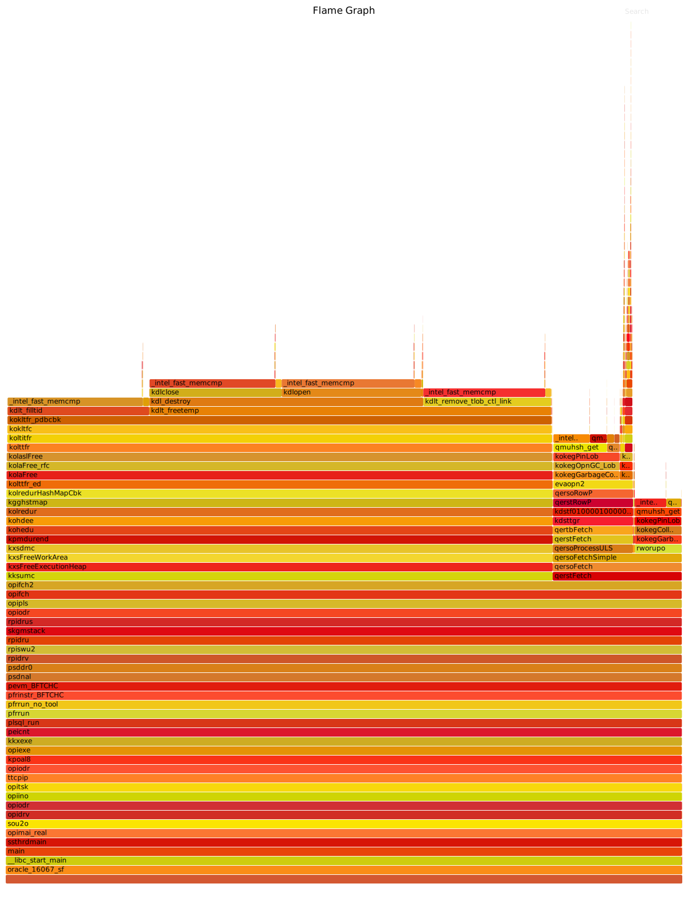

---
categories:
  - Oracle
date:
  created: 2019-10-23T20:00:00
description: >-
  Oracle can create temporary LOBs when SQL functions are used on LOBs.
  For example, SUBSTR behaves like that.
  Those calls can be replaced with DBMS_LOB.SUBSTR that does not lead to the aforementioned deficiency.
tags:
  - 12c
  - Code symbol
  - Diagnostic event
  - LOB
  - Performance
---

# Temporary LOBs

I have recently optimized one of processes working with LOBs and decided to write a blog post about it.

<!-- more -->

## Investigation

There was an anonymous block like the following:

```sql
declare
  v_result clob;
begin
  for test_rec in (
    select substr(clob_col, 1, 32000) clob_part1,
           substr(clob_col, 32001, 32000) clob_part2
      from driving_table
     where some_conditions
     order by sort_column)
  loop
    v_result := v_result || test_rec.clob_part1 || ';' || test_rec.clob_part2;
  end loop;
end;
/
```

In a nutshell, that block unloaded some `CLOB` data to a `CLOB`.
Developers identified that this block was working quite fine being run for a relatively small number of rows, but the performance was deteriorating drastically when the same block was running against a large number of rows.

To set the scene for further analysis, let's create a table with 100K rows that has a 100 byte `CLOB` column:

```sql
SQL> create table t100(
  2    n int generated as identity,
  3    c clob);

Table created.

SQL>
SQL> insert /*+ append*/into t100(c)
  2  select lpad('x', 100, 'x')
  3    from xmltable('1 to 100000');

100000 rows created.

SQL>
SQL> commit;
```

Firstly, I show what happens when I try to emulate the original cursor:

```sql hl_lines="72"
-- I am gathering some memory statistics to be used in further research
SQL> select pga_used_mem, pga_alloc_mem
  2    from v$session s,
  3         v$process p
  4   where s.sid = sys_context('userenv', 'sid')
  5     and p.addr = s.paddr;

PGA_USED_MEM PGA_ALLOC_MEM
------------ -------------
     2544108       4114740

SQL>
SQL> select pm.*
  2    from v$session s,
  3         v$process p,
  4         v$process_memory pm
  5   where s.sid = sys_context('userenv', 'sid')
  6     and p.addr = s.paddr
  7     and pm.pid = p.pid
  8   order by pm.category;

       PID    SERIAL# CATEGORY         ALLOCATED       USED MAX_ALLOCATED     CON_ID
---------- ---------- --------------- ---------- ---------- ------------- ----------
        77        157 Other              5667940                  5667940          3
        77        157 PL/SQL               30744      23680         31920          3
        77        157 SQL                  54456      43688        319280          3

SQL>
SQL> var rc refcursor
SQL>
SQL> begin
  2    open :rc for
  3      select n,
  4             substr(c, 1, 40) c_part1,
  5             substr(c, 41, 40) c_part2,
  6             substr(c, 81, 40) c_part3
  7        from t100
  8       where n <= 50000
  9       order by n;
 10  end;
 11  /

PL/SQL procedure successfully completed.

SQL> declare
  2    n int;
  3    c1 clob;
  4    c2 c1%type;
  5    c3 c1%type;
  6  begin
  7    fetch :rc
  8      into n, c1, c2, c3;
  9  end;
 10  /

PL/SQL procedure successfully completed.

SQL>
SQL>
SQL> select pm.*
  2    from v$session s,
  3         v$process p,
  4         v$process_memory pm
  5   where s.sid = sys_context('userenv', 'sid')
  6     and p.addr = s.paddr
  7     and pm.pid = p.pid
  8   order by pm.category;

       PID    SERIAL# CATEGORY         ALLOCATED       USED MAX_ALLOCATED     CON_ID
---------- ---------- --------------- ---------- ---------- ------------- ----------
        77        157 Freeable           1048576          0                        3
        77        157 Other           1375048620               1375048620          3
        77        157 PL/SQL               32856      23104         60960          3
        77        157 SQL               14988592   11145152      17361192          3
```

Oops!
The code allocated **1.3G** PGA in the Other category.
There are also **150K** abstract LOBs created:

```sql hl_lines="7"
SQL> select *
  2    from v$temporary_lobs
  3   where sid = sys_context('userenv', 'sid');

       SID CACHE_LOBS NOCACHE_LOBS ABSTRACT_LOBS     CON_ID
---------- ---------- ------------ ------------- ----------
       435          0            0        150000          3
```

Let us find out what we have in `V$PROCESS_MEMORY_DETAIL`:

```sql
SQL> alter session set events 'immediate trace name pga_detail_get level 77';

Session altered.

SQL> select name, heap_name, bytes, allocation_count, bytes/150000
  2    from v$process_memory_detail
  3   where pid = 77
  4     and category = 'Other'
  5     and allocation_count >= 140000
  6   order by allocation_count
  7  /

NAME                       HEAP_NAME            BYTES ALLOCATION_COUNT BYTES/150000
-------------------------- --------------- ---------- ---------------- ------------
kghdsx                     kokltcr: creat    16800000           150000          112
free permanent memory      kokltcr: creat    15600216           150000    104.00144
kolrarfc:lobloc_kolrhte    kolr heap ds i     9610304           150000   64.0686933
kolraloc-1                 kolr heap ds i    12289592           150002   81.9306133
kokltcr: create clob       koh dur heap d    53599912           300000   357.332747
kghsseg: kolaslCreateCtx   kokltcr: creat  1212000000           300000         8080
```

That is more than 8,192 bytes per abstract LOB even for these 40 byte LOBs!
These are in-memory LOBs, however, memory is a limited resource obviously and Oracle can create non-in-memory LOBs starting with a certain number of abstract LOBs (it is around 215K LOBs in my test database).
Notice that I limited the number of rows to 100K to create 300K abstract LOBs:

```sql hl_lines="8 36"
SQL> begin
  2    open :rc for
  3      select n,
  4             substr(c, 1, 40) c_part1,
  5             substr(c, 41, 40) c_part2,
  6             substr(c, 81, 40) c_part3
  7        from t100
  8       where n <= 100000
  9       order by n;
 10  end;
 11  /

PL/SQL procedure successfully completed.

Elapsed: 00:00:00.20
SQL> declare
  2    n int;
  3    c1 clob;
  4    c2 c1%type;
  5    c3 c1%type;
  6  begin
  7    fetch :rc
  8      into n, c1, c2, c3;
  9  end;
 10  /

PL/SQL procedure successfully completed.

Elapsed: 00:01:08.04
SQL> select *
  2    from v$temporary_lobs
  3   where sid = sys_context('userenv', 'sid');

       SID CACHE_LOBS NOCACHE_LOBS ABSTRACT_LOBS     CON_ID
---------- ---------- ------------ ------------- ----------
       435      84626            0        300000          3
```

Here is the output from `V$TEMPSEG_USAGE`:

```sql hl_lines="8"
SQL> select contents, segtype, blocks
  2    from v$tempseg_usage
  3   where session_num = 61759;

CONTENTS  SEGTYPE       BLOCKS
--------- --------- ----------
TEMPORARY SORT            1792
TEMPORARY LOB_DATA       84736
```

After enabling an event `trace[LOB_REFCOUNT]`, the following can be seen in the tracefile:

``` hl_lines="1 11 20 25"
PGA usage percent: 74 percent, isMaxHeap reached?: 0, Mem check freq: 50
kolrarfc:  0x55 0xbc 0x0d 0x00 0x00 0x03 0x40 0x9e  : 1
kolrarfc: kolaCreateClob()+123<-kolaslCreateClob()+144<-kole_templob_init()+431<-kole_substr()+728<-kokle_substr()+340<-evaopn2()+612<-qersoRowP()+2657<-qerstRowP()+802<-kdstf010000100000000kmP()+1377<-kdsttgr()+2149<-qertbFetch()+1409<-qerstFetch()+477<-qersoProcessULS()+300<-qersoFetchSimple()+1433<-qersoFetch()+210
kolradls:  0x55 0xbc 0x0d 0x00 0x00 0x03 0x40 0x9e  : 1 (32)
kolrarfc:  0x55 0xbc 0x0d 0x00 0x00 0x03 0x40 0x9e  : 2
kolrarfc: kokegOpnGarbagePromote()+103<-qersoRowP()+2069<-qerstRowP()+802<-kdstf010000100000000kmP()+1377<-kdsttgr()+2149<-qertbFetch()+1409<-qerstFetch()+477<-qersoProcessULS()+300<-qersoFetchSimple()+1433<-qersoFetch()+210<-qerstFetch()+477<-opifch2()+3267<-opifch()+62<-opipls()+7312<-opiodr()+1229
kolradc :  0x55 0xbc 0x0d 0x00 0x00 0x03 0x40 0x9e  : 2 (32)

...skip...

PGA usage percent: 75 percent, isMaxHeap reached?: 1, Mem check freq: 25
kolrarfc:  0x55 0xbc 0x0d 0x00 0x00 0x03 0x42 0x2e  : 1
kolrarfc: kolaCreateClob()+123<-kolaslCreateClob()+144<-kole_templob_init()+431<-kole_substr()+728<-kokle_substr()+340<-evaopn2()+612<-qersoRowP()+2657<-qerstRowP()+802<-kdstf010000100000000kmP()+1377<-kdsttgr()+2149<-qertbFetch()+1409<-qer
stFetch()+477<-qersoProcessULS()+300<-qersoFetchSimple()+1433<-qersoFetch()+210
kolradls:  0x55 0xbc 0x0d 0x00 0x00 0x03 0x42 0x2e  : 1 (32)
kolrarfc:  0x55 0xbc 0x0d 0x00 0x00 0x03 0x42 0x2e  : 2
kolrarfc: kokegOpnGarbagePromote()+103<-qersoRowP()+2069<-qerstRowP()+802<-kdstf010000100000000kmP()+1377<-kdsttgr()+2149<-qertbFetch()+1409<-qerstFetch()+477<-qersoProcessULS()+300<-qersoFetchSimple()+1433<-qersoFetch()+210<-qerstFetch()+4
77<-opifch2()+3267<-opifch()+62<-opipls()+7312<-opiodr()+1229
kolradc :  0x55 0xbc 0x0d 0x00 0x00 0x03 0x42 0x2e  : 2 (32)
Max limit reached for in-mem heap allocation
kolrarfc:  0x55 0xbc 0x0d 0x00 0x00 0x03 0x42 0x2f  : 1
kolrarfc: kolaCreateClob()+123<-kolaslCreateClob()+144<-kole_templob_init()+431<-kole_substr()+728<-kokle_substr()+340<-evaopn2()+612<-qersoRowP()+2657<-qerstRowP()+802<-kdstf010000100000000kmP()+1377<-kdsttgr()+2149<-qertbFetch()+1409<-qerstFetch()+477<-qersoProcessULS()+300<-qersoFetchSimple()+1433<-qersoFetch()+210
kolradls:  0x55 0xbc 0x0d 0x00 0x00 0x03 0x42 0x2f  : 1 (32)
kolrarfc:  0x55 0xbc 0x0d 0x00 0x00 0x03 0x42 0x30  : 1
kolrarfc: kokltcc()+131<-koltitcr()+364<-kolttcr()+72<-kolaslWriteCreateTempLob()+607<-kolaslWrite()+656<-kolaWrite()+289<-kolaCopy()+726<-koklAbsCopy()+69<-kokasuc()+247<-koklcopy2()+4270<-koklc_copy()+78<-kole_append()+211<-kole_templob_init()+354<-kole_substr()+728<-kokle_substr()+340
```

Once the session reached the max heap, which seems to be **75%** in my environment, it starts allocating non-in-memory temporary LOBs and there are functions such as `kolaslWrite` and `kolaslWriteCreateTempLob` on the callstack that implies that they might be writing something to the temporary tablespace.

Let us take a look now at the following PL/SQL block that emulates what the application code does:

```sql hl_lines="32 33 37"
SQL> declare
  2    v_reporting_freq constant pls_integer := 20000;
  3    procedure log_info(i_msg varchar2)
  4    is
  5    begin
  6      dbms_output.put_line(to_char(sysdate, 'hh24:mi:ss')||' '||i_msg);
  7    end log_info;
  8  begin
  9    log_info('Starting execution');
 10    for test_rec in (
 11      select n,
 12             substr(c, 1, 40) c_part1,
 13             substr(c, 41, 40) c_part2,
 14             substr(c, 81, 40) c_part3
 15        from t100
 16       where n <= 100000
 17       order by n)
 18    loop
 19      if mod(test_rec.n, v_reporting_freq) = 0
 20      then
 21        log_info('Processed '||v_reporting_freq||' rows');
 22      end if;
 23    end loop;
 24    log_info('Finishing execution');
 25  end;
 26  /
06:35:34 Starting execution
06:36:58 Processed 20000 rows
06:37:10 Processed 20000 rows
06:37:18 Processed 20000 rows
06:37:21 Processed 20000 rows
06:37:22 Processed 20000 rows
06:44:52 Finishing execution

PL/SQL procedure successfully completed.

Elapsed: 00:09:18.82
```

There are a few observations about this output:

1. The `SELECT` was running from **35:34** to **37:22**, it is **108** seconds.
1. The block itself was running in 9 minutes 18 seconds or in **558** seconds, which is **108 (SELECT) + 450 (other)**
1. What exactly happened between **06:37:22**, when was the last fetch, and **06:44:52** - that is exactly **450** seconds, when the block finished?

Here is a TKPROF processed tracefile:

```
SQL ID: btysk50atwccn Plan Hash: 1939537825

SELECT N, SUBSTR(C, 1, 40) C_PART1, SUBSTR(C, 41, 40) C_PART2, SUBSTR(C, 81,
  40) C_PART3
FROM
 T100 WHERE N <= 100000 ORDER BY N


call     count       cpu    elapsed       disk      query    current        rows
------- ------  -------- ---------- ---------- ---------- ----------  ----------
Parse        1      0.00       0.00          0          0          0           0
Execute      1      0.00       0.00          0          0          0           0
Fetch     1001    106.43     107.82       5029       3341     649751      100000
------- ------  -------- ---------- ---------- ---------- ----------  ----------
total     1003    106.43     107.82       5029       3341     649751      100000

Misses in library cache during parse: 0
Optimizer mode: ALL_ROWS
Parsing user id: 107     (recursive depth: 1)
Number of plan statistics captured: 1

Rows (1st) Rows (avg) Rows (max)  Row Source Operation
---------- ---------- ----------  ---------------------------------------------------
    100000     100000     100000  SORT ORDER BY (cr=3341 pr=5029 pw=1695 time=108105549 us starts=1 cost=2080 size=4600000 card=100000)
    100000     100000     100000   TABLE ACCESS FULL T100 (cr=3341 pr=3334 pw=0 time=474939 us starts=1 cost=923 size=4600000 card=100000)


Elapsed times include waiting on following events:
  Event waited on                             Times   Max. Wait  Total Waited
  ----------------------------------------   Waited  ----------  ------------
  PGA memory operation                        37387        0.00          0.29
  Disk file operations I/O                        2        0.00          0.00
  db file scattered read                         67        0.00          0.09
  CSS initialization                              1        0.00          0.00
  CSS operation: query                            6        0.00          0.00
  CSS operation: action                           1        0.00          0.00
  direct path write temp                         26        0.00          0.02
  direct path read temp                          66        0.00          0.07

********************************************************************************

declare
  v_reporting_freq constant pls_integer := 20000;
  procedure log_info(i_msg varchar2)
  is
  begin
    dbms_output.put_line(to_char(sysdate, 'hh24:mi:ss')||' '||i_msg);
  end log_info;
begin
  log_info('Starting execution');
  for test_rec in (
    select n,
           substr(c, 1, 40) c_part1,
           substr(c, 41, 40) c_part2,
           substr(c, 81, 40) c_part3
      from t100
     where n <= 100000
     order by n)
  loop
    if mod(test_rec.n, v_reporting_freq) = 0
    then
      log_info('Processed '||v_reporting_freq||' rows');
    end if;
  end loop;
  log_info('Finishing execution');
end;

call     count       cpu    elapsed       disk      query    current        rows
------- ------  -------- ---------- ---------- ---------- ----------  ----------
Parse        1      0.00       0.00          0          0          0           0
Execute      1    446.41     450.44          0          0     468361           1
Fetch        0      0.00       0.00          0          0          0           0
------- ------  -------- ---------- ---------- ---------- ----------  ----------
total        2    446.41     450.44          0          0     468361           1

Misses in library cache during parse: 0
Optimizer mode: ALL_ROWS
Parsing user id: 107

Elapsed times include waiting on following events:
  Event waited on                             Times   Max. Wait  Total Waited
  ----------------------------------------   Waited  ----------  ------------
  PGA memory operation                          419        0.11          0.13
  SQL*Net message to client                       1        0.00          0.00
  SQL*Net message from client                     1        0.10          0.10
```

There are no waits that can explain why the block took 450 seconds to execute.
Let us get to the raw tracefile then:

``` hl_lines="38 42"
PARSING IN CURSOR #140371888210368 len=617 dep=0 uid=107 oct=47 lid=107 tim=9831631653615 hv=2253167668 ad='c9f31410' sqlid='3sfmy3y34t71n'
declare
  v_reporting_freq constant pls_integer := 20000;
  procedure log_info(i_msg varchar2)
  is
  begin
    dbms_output.put_line(to_char(sysdate, 'hh24:mi:ss')||' '||i_msg);
  end log_info;
begin
  log_info('Starting execution');
  for test_rec in (
    select n,
           substr(c, 1, 40) c_part1,
           substr(c, 41, 40) c_part2,
           substr(c, 81, 40) c_part3
      from t100
     where n <= 100000
     order by n)
  loop
    if mod(test_rec.n, v_reporting_freq) = 0
    then
      log_info('Processed '||v_reporting_freq||' rows');
    end if;
  end loop;
  log_info('Finishing execution');
end;
END OF STMT
PARSE #140371888210368:c=96,e=95,p=0,cr=0,cu=0,mis=0,r=0,dep=0,og=1,plh=0,tim=9831631653614
=====================
PARSING IN CURSOR #140371888222536 len=127 dep=1 uid=107 oct=3 lid=107 tim=9831631654062 hv=362688916 ad='c91e39a0' sqlid='btysk50atwccn'
SELECT N, SUBSTR(C, 1, 40) C_PART1, SUBSTR(C, 41, 40) C_PART2, SUBSTR(C, 81, 40) C_PART3 FROM T100 WHERE N <= 100000 ORDER BY N
END OF STMT
PARSE #140371888222536:c=95,e=95,p=0,cr=0,cu=0,mis=0,r=0,dep=1,og=1,plh=1939537825,tim=9831631654062
EXEC #140371888222536:c=41,e=41,p=0,cr=0,cu=0,mis=0,r=0,dep=1,og=1,plh=1939537825,tim=9831631654152

..skip..
FETCH #140371888222536:c=946,e=539,p=0,cr=0,cu=0,mis=0,r=100,dep=1,og=1,plh=1939537825,tim=9831739623035
FETCH #140371888222536:c=59,e=59,p=0,cr=0,cu=0,mis=0,r=0,dep=1,og=1,plh=1939537825,tim=9831739623185
STAT #140371888222536 id=1 cnt=100000 pid=0 pos=1 obj=0 op='SORT ORDER BY (cr=3341 pr=5029 pw=1695 str=1 time=108105549 us cost=2080 size=4600000 card=100000)'
STAT #140371888222536 id=2 cnt=100000 pid=1 pos=1 obj=158217 op='TABLE ACCESS FULL T100 (cr=3341 pr=3334 pw=0 str=1 time=474939 us cost=923 size=4600000 card=100000)'

*** 2019-10-23 06:44:52.738 (PDB(3))
CLOSE #140371888222536:c=1,e=1,dep=1,type=3,tim=9832189916721
EXEC #140371888210368:c=552847911,e=558267064,p=5029,cr=3341,cu=1118112,mis=0,r=1,dep=0,og=1,plh=0,tim=9832189920765

*** 2019-10-23 06:44:52.934 (PDB(3))
WAIT #140371888210368: nam='PGA memory operation' ela= 89 p1=0 p2=0 p3=0 obj#=158217 tim=9832190113279
WAIT #140371888210368: nam='PGA memory operation' ela= 61 p1=0 p2=0 p3=0 obj#=158217 tim=9832190113427
```

The tracefile does not show what was going on between the last fetch(`tim=9831739623185`) and the time the cursor was closed(`tim=9832189916721`).

Here is the `V$ACTIVE_SESSION_HISTORY` (ASH) output for the problem block:

```sql hl_lines="28 52 61"
SQL> select to_char(sample_time, 'hh24:mi:ss') sample_time, sql_id, sql_opname, top_level_sql_id, session_state, event,
  2         trim(case when IN_CONNECTION_MGMT='Y' then ' IN_CONNECTION_MGMT' end||
  3              case when IN_PARSE='Y' then ' IN_PARSE' end||
  4              case when IN_HARD_PARSE='Y' then ' IN_HARD_PARSE' end||
  5              case when IN_SQL_EXECUTION='Y' then ' IN_SQL_EXECUTION' end||
  6              case when IN_PLSQL_EXECUTION='Y' then ' IN_PLSQL_EXECUTION' end||
  7              case when IN_PLSQL_RPC='Y' then ' IN_PLSQL_RPC' end||
  8              case when IN_PLSQL_COMPILATION='Y' then ' IN_PLSQL_COMPILATION' end||
  9              case when IN_JAVA_EXECUTION='Y' then ' IN_JAVA_EXECUTION' end||
 10              case when IN_BIND='Y' then ' IN_BIND' end||
 11              case when IN_CURSOR_CLOSE='Y' then ' IN_CURSOR_CLOSE' end||
 12              case when IN_SEQUENCE_LOAD='Y' then ' IN_SEQUENCE_LOAD' end||
 13              case when IN_INMEMORY_QUERY='Y' then ' IN_INMEMORY_QUERY' end||
 14              case when IN_INMEMORY_POPULATE='Y' then ' IN_INMEMORY_POPULATE' end||
 15              case when IN_INMEMORY_PREPOPULATE='Y' then ' IN_INMEMORY_PREPOPULATE' end||
 16              case when IN_INMEMORY_REPOPULATE='Y' then ' IN_INMEMORY_REPOPULATE' end||
 17              case when IN_INMEMORY_TREPOPULATE='Y' then ' IN_INMEMORY_TREPOPULATE' end||
 18              case when IN_TABLESPACE_ENCRYPTION='Y' then ' IN_TABLESPACE_ENCRYPTION' end) activity,
 19         pga_allocated,
 20         temp_space_allocated
 21    from v$active_session_history
 22   where session_id = 52
 23     and sample_time >= timestamp'2019-10-23 06:35:33'
 24   order by sample_time;

SAMPLE_T SQL_ID        SQL_OPNAME    TOP_LEVEL_SQL SESSION_STATE EVENT      ACTIVITY         PGA_ALLOCATED TEMP_SPACE_ALLOCATED
-------- ------------- ------------- ------------- ------------- ---------- ---------------- ------------- --------------------
-- the execution starts and the session steadily allocates PGA and TEMP
06:35:35 btysk50atwccn SELECT        3sfmy3y34t71n ON CPU                   IN_SQL_EXECUTION     316826624                    0
06:35:36 btysk50atwccn SELECT        3sfmy3y34t71n ON CPU                   IN_SQL_EXECUTION     526869504                    0
06:35:37 btysk50atwccn SELECT        3sfmy3y34t71n ON CPU                   IN_SQL_EXECUTION     667640832                    0
06:35:38 btysk50atwccn SELECT        3sfmy3y34t71n ON CPU                   IN_SQL_EXECUTION     775185408                    0
06:35:39 btysk50atwccn SELECT        3sfmy3y34t71n ON CPU                   IN_SQL_EXECUTION     870933504              5242880
06:35:40 btysk50atwccn SELECT        3sfmy3y34t71n ON CPU                   IN_SQL_EXECUTION     946693120              5242880
06:35:41 btysk50atwccn SELECT        3sfmy3y34t71n ON CPU                   IN_SQL_EXECUTION    1025664000              5242880
06:35:42 btysk50atwccn SELECT        3sfmy3y34t71n ON CPU                   IN_SQL_EXECUTION    1087202304              5242880
06:35:43 btysk50atwccn SELECT        3sfmy3y34t71n ON CPU                   IN_SQL_EXECUTION    1153000448              6291456
06:35:44 btysk50atwccn SELECT        3sfmy3y34t71n ON CPU                   IN_SQL_EXECUTION    1216242688              6291456
06:35:45 btysk50atwccn SELECT        3sfmy3y34t71n ON CPU                   IN_SQL_EXECUTION    1276404736              6291456
06:35:46 btysk50atwccn SELECT        3sfmy3y34t71n ON CPU                   IN_SQL_EXECUTION    1321624576              6291456
06:35:47 btysk50atwccn SELECT        3sfmy3y34t71n ON CPU                   IN_SQL_EXECUTION    1372152832              7340032
06:35:48 btysk50atwccn SELECT        3sfmy3y34t71n ON CPU                   IN_SQL_EXECUTION    1424450560              7340032
06:35:49 btysk50atwccn SELECT        3sfmy3y34t71n ON CPU                   IN_SQL_EXECUTION    1474192384              7340032
06:35:50 btysk50atwccn SELECT        3sfmy3y34t71n ON CPU                   IN_SQL_EXECUTION    1520133120              7340032
06:35:51 btysk50atwccn SELECT        3sfmy3y34t71n ON CPU                   IN_SQL_EXECUTION    1563255808              7340032
06:35:52 btysk50atwccn SELECT        3sfmy3y34t71n ON CPU                   IN_SQL_EXECUTION    1593336832              8388608

..skip..

SAMPLE_T SQL_ID        SQL_OPNAME    TOP_LEVEL_SQL SESSION_STATE EVENT      ACTIVITY         PGA_ALLOCATED TEMP_SPACE_ALLOCATED
-------- ------------- ------------- ------------- ------------- ---------- ---------------- ------------- --------------------
-- the SELECT completes
06:37:19 btysk50atwccn SELECT        3sfmy3y34t71n ON CPU                   IN_SQL_EXECUTION    2461950976            715128832
06:37:20 btysk50atwccn SELECT        3sfmy3y34t71n ON CPU                   IN_SQL_EXECUTION    2461950976            715128832
06:37:21 btysk50atwccn SELECT        3sfmy3y34t71n ON CPU                   IN_SQL_EXECUTION    2461950976            715128832
06:37:23                             3sfmy3y34t71n ON CPU                   IN_SQL_EXECUTION    2460902400            700448768
06:37:24                             3sfmy3y34t71n ON CPU                   IN_SQL_EXECUTION    2460902400            700448768
06:37:25                             3sfmy3y34t71n ON CPU                   IN_SQL_EXECUTION    2460902400            700448768
06:37:26                             3sfmy3y34t71n ON CPU                   IN_SQL_EXECUTION    2460902400            700448768

-- the session is burning up CPUs
06:44:50                             3sfmy3y34t71n ON CPU                   IN_SQL_EXECUTION    2460902400            700448768
06:44:51                             3sfmy3y34t71n ON CPU                   IN_SQL_EXECUTION    2460902400            700448768
06:44:52                             3sfmy3y34t71n ON CPU                   IN_SQL_EXECUTION    2460902400            700448768
```

I would rather expect to see some PGA and TEMP deallocations between **06:37:22** (the time when the `SELECT` completes) and **06:44:52** (the time when the block completes) but there are none.

While I was looking at `V$TEMPORARY_LOBS`, I was observing that the session was constantly releasing LOBs during the period in question.
Remember there are **300K** abstract LOBs created - they are being released in those **450** seconds.
However, it is not reflected in ASH as far as I am aware.
All PGA and TEMP deallocations happen at once and there is really no hint in ASH to figure out what is going on.

Let us take a look at the flame graph to see what Oracle functions contributed to most load:



It can be seen that there are functions such as `kokegGarbageCollectOpn` and `kokegGarbageCollectRworo` that were active when `qersoFetch` was active (19% of the time).
Those seem to be related to garbage collection and the `koke` prefix is present in the oradebug doc component output:

``` hl_lines="4"
OBJECTS                      OBJECTS ((null))
    OBJECTS_DDL                OBJECTS DDL (kokt)
    OBJECTS_Types              OBJECTS Types (kot, ko, ort)
    OBJECTS_Images             OBJECTS Images (koke, kot, kad)
```

Most of the time (80%), though, the functions such as: `kksumc`, `kxsFreeExecutionHeap` were active - they are supposedly related to releasing memory.
Oracle code might not be updating `PGA_ALLOCATED`, `TEMP_SPACE_ALLOCATED` till the whole duration is freed as I do not see any changes in those columns of `V$ACTIVE_SESSION_HISTORY`.

When I found that `SUBSTR` on LOBs produces new abstract LOBs, I implemented the following workaround:

```sql hl_lines="14 15 16 45"
SQL> declare
  2    v_reporting_freq constant pls_integer := 20000;
  3    v_result clob;
  4    procedure log_info(i_msg varchar2)
  5    is
  6    begin
  7      dbms_output.put_line(to_char(sysdate, 'hh24:mi:ss')||' '||i_msg);
  8    end log_info;
  9  begin
 10    log_info('Starting execution');
 11    dbms_lob.createtemporary(v_result, cache=> true, dur=> dbms_lob.call);
 12    for test_rec in (
 13      select n,
 14             dbms_lob.substr(c, 40, 1) c_part1,
 15             dbms_lob.substr(c, 40, 41) c_part2,
 16             dbms_lob.substr(c, 40, 81) c_part3
 17        from t100
 18       where n <= 100000
 19       order by n)
 20    loop
 21      dbms_lob.append(v_result, test_rec.c_part1);
 22      dbms_lob.append(v_result, test_rec.c_part2);
 23      dbms_lob.append(v_result, test_rec.c_part3);
 24      if mod(test_rec.n, v_reporting_freq) = 0
 25      then
 26        log_info('Processed '||v_reporting_freq||' rows');
 27      end if;
 28    end loop;
 29    dbms_output.put_line('Lob size: '||dbms_lob.getlength(v_result));
 30    dbms_lob.freetemporary(v_result);
 31    log_info('Finishing execution');
 32  end;
 33  /
08:15:04 Starting execution
08:15:08 Processed 20000 rows
08:15:09 Processed 20000 rows
08:15:10 Processed 20000 rows
08:15:12 Processed 20000 rows
08:15:13 Processed 20000 rows
Lob size: 10000000
08:15:13 Finishing execution

PL/SQL procedure successfully completed.

Elapsed: 00:00:08.95
```

In spite of the fact that this block even writes a whole new LOB (there are no such operations in the block that was working **9 minutes**), it completes just in **9 seconds**.
It is quite a neat optimization, isn't it?

That behavior of producing abstract LOBs of `SUBSTR` is documented: [Database SecureFiles and Large Objects Developer's Guide: Temporary LOBs](https://docs.oracle.com/en/database/oracle/oracle-database/19/adlob/performance-guidelines.html#GUID-4E9360AA-C610-4341-AAD3-9DCDF82CF085):
If you use the newly provided enhanced SQL semantics functionality in your applications, then **there are many more temporary LOBs created silently in SQL and PL/SQL than before**.
Ensure that temporary tablespace for storing these temporary LOBs is large enough for your applications.
In particular, these temporary LOBs are silently created when you use one of the following:

- **SQL functions on LOBs**
- PL/SQL built-in character functions on LOBs
- Variable assignments from `VARCHAR2`/`RAW` to CLOBs/BLOBs, respectively.
- Perform a LONG-to-LOB migration

If SQL operators are used on LOBs, the PGA memory and temporary tablespace must be large enough to accommodate the temporary LOBs generated by SQL operators.

Apart from that workaround, I can come up with a few others that also provide significant performance boost:

1. This query is almost a corner-case due to that sorting.
   If the `ORDER BY` is really needed, then an indexed access on the `N` column can be considered.
1. These `SUBSTR` calls can be moved within the `LOOP` part, so that only the `C` column is selected in the query.
   Although it would not be the most efficient way to process the cursor (abstract LOBs will still be allocated), those abstract LOBs will be released after each iteration.
   Therefore, the time-consuming garbage collection at the end will be avoided.

All tests were performed on 12.2.0.1.190716.
19c has some nice optimizations, such as one mentioned in [Session spending its time IN\_CURSOR\_CLOSE](session-spending-its-time-in_cursor_close.md)
I was trying to reproduce that issue on 19c but I was not able to get the same results after a few attempts.
Though abstract LOBs were still allocated, they were being released rather quickly.

## tl;dr

Oracle can create temporary LOBs when SQL functions are used on LOBs as this blog post demonstrates.
For example, `SUBSTR` behaves like that.
Those calls can be replaced with `DBMS_LOB.SUBSTR` that does not lead to the aforementioned deficiency.
